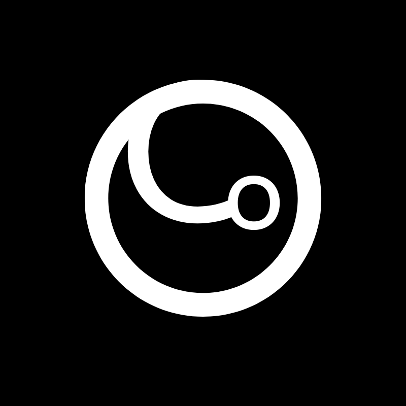

<h1 align="center">
  
  <br>GloboConnect<br/>
  ReactJS | React Native | Expo
  <br/>
  <a href="https://wakatime.com/badge/user/920a7e43-2969-4212-82ff-1b375685ff58/project/018be26e-2b96-47eb-883c-51616c833d2b"></a>
</h1>

<p align="center">
  
  
</p>

<p align="center">
  <a href="#bookmark-sobre-o-projeto">Sobre o Projeto</a>
  &nbsp;&nbsp;&nbsp;|&nbsp;&nbsp;&nbsp;
  <a href="#stop_sign-limitações">Limitações</a>&nbsp;&nbsp;&nbsp;|&nbsp;&nbsp;&nbsp;
  <a href="#raising_hand_man-usuários-da-plataforma">Usuários da Plataforma</a>&nbsp;&nbsp;&nbsp;|&nbsp;&nbsp;&nbsp;
  <a href="#boom-como-executar">Como executar?</a>&nbsp;&nbsp;&nbsp;|&nbsp;&nbsp;&nbsp;
  <a href="#iphone-demonstração">Demonstração</a>&nbsp;&nbsp;&nbsp;|&nbsp;&nbsp;&nbsp;
  <a href="#memo-licença">Licença</a>
</p>

## :bookmark: Sobre o Projeto

O GloboConnect é um aplicativo de redes sociais que faz o upload de vídeos curtos e exibi em um feed para vários usuários. Uma fusão de "Globo" (global) e "Connect" (conectar), sugerindo um aplicativo com foco em conexões globais ou redes sociais.

Com o GloboConnect você pode interagir via curtidas, descurtir, comentar e compartilhar postagens.

Você também pode postar suas próprias publicações e vizualizar o perfil de outros usuários atráves da Home clicando na foto ou nickname deles.

Este projeto foi desenvolvido por [Daniel Sansão Araldi](https://github.com/DanielAraldi) para o teste do processo seletivo da [GRPCOM](https://www.grpcom.com.br/).

## :stop_sign: Limitações

1. O GloboConnect foi desenvolvido utilizando Expo por conta da limitação do **sistema operacional**, o qual foi utilizado **Windows**.
2. A plataforma **alvo** no desenvolvimento foi **iOS** por conta de não ter dispositivos **Android** disponíveis para testar o aplicativo.
3. Foram realizadas as tentativas de tentar **emular** dispositivos **Android** no computador, mas se tornou insuficiente, tornando o desenvolvimento muito lento.
4. Deixo claro que, existe possibilidades de que dispositivos **Android** não estejam funcionando corretamente ou até mesmo apresentando erros no aplicativo. Pois, como dito anteriormente, **não** tinha dispositivos **Android** disponíveis para testar o aplicativo.
5. O upload dos vídeos é feito atráves de um caminho `file://` que o Expo ImagePicker e o Expo Camera retornam em suas respostas e são armazenados no server mockado, no caso, a URI deste vídeo pertece ao dispositivo o qual fez o upload dele. Caso você tente acessar essa mesma URI por **outro** dispositivo isso não irá funcionar, pois esse caminho não existe neste dispositivo, somente no outro.

## :raising_hand_man: Usuários da Plataforma

| E-mail                      | Senha    | Tem postagem? |
| --------------------------- | -------- | ------------- |
| `rafaelmota@gmail.com`      | `abc123` | **Sim**       |
| `filipedeschamps@gmail.com` | `abc123` | **Sim**       |
| `rocketseat@gmail.com`      | `abc123` | **Sim**       |
| `maykbrito@gmail.com`       | `abc123` | **Sim**       |
| `diego3g@gmail.com`         | `abc123` | **Sim**       |
| `marcosjbm@gmail.com`       | `abc123` | **Não**       |
| `danielsaraldi@gmail.com`   | `abc123` | **Não**       |

## :boom: Como executar?

- ### **Pré-requisitos**

  - É **necessário** possuir **[Git](https://git-scm.com/)** instalado e configurado no seu computador.
  - Também, é **preciso** ter pacotes de gerencimento como **[Yarn](https://yarnpkg.com/)**, **[NPM](https://www.npmjs.com/)**, etc.
  - Por fim, é **necessário** ter [Node.js](https://nodejs.org/en) maior ou igual a versão 16 instalada na sua máquina.

1. Clonando o repositório:

```sh
  $ git clone https://github.com/DanielAraldi/globoconnect.git
```

2. Instalando as dependencias:

```sh
  $ cd globoconnect # na raiz do projeto
  $ npm install # ou yarn install para instalar as dependencias
```

2. Na raiz do projeto, vá no arquivo chamado `package.json`. No script chamado **server** e substitua a palavra **YOUR_HOST** pelo IP da sua máquina.

> Se você não souber o IP da sua máquina, basta abrir o terminal como administrador e escrever `ipconfig` e dar **enter** que irá aparecer o IP da sua máquina para você.

```json
  // package.json
  "scripts": {
    "start": "expo start",
    "android": "expo start --android",
    "ios": "expo start --ios",
    "web": "expo start --web",
    "lint": "eslint --fix ./**/*.{ts,tsx}",
    "pretty": "prettier --write .",
    "prepare": "husky install",
    "server": "npx json-server ./src/services/mock/server.json --host YOUR_HOST --port 8080 --delay 300" // <-- Substiua o YOUR_HOST que está nessa linha
  },
```

3. Agora, vá em `./src/config/env.ts`. Lá existe uma constante chamada `HOST`, substitua o valor dela pelo IP da sua máquina.

> Se você não souber o IP da sua máquina, basta abrir o terminal como administrador e escrever `ipconfig` e dar **enter** que irá aparecer o IP da sua máquina para você.

```ts
// src/config/env.ts
export const HOST = 'YOUR_HOST'; // <-- Substiua o YOUR_HOST que está nessa linha
export const PORT = '8080';
```

4. Executando a API mockada:

```sh
  $ cd globoconnect # na raiz do projeto
  $ npm run server # yarn server para executar a API mockada
```

5. Executando o App:

```sh
  $ cd globoconnect # na raiz do projeto
  $ npm run start # yarn start para executar o app
```

## :iphone: Demonstração

Para ver a demostração do aplicativo, basta [clicar aqui](https://drive.google.com/file/d/1NuX3eEjTBzDsWP3ION1bzk-5Qp4a0EQU/view?usp=sharing) e baixar o vídeo de demonstração!

## :memo: Licença

Este projeto está sobre licença MIT. Veja mais em [licença](./LICENSE) para mais detalhes.
